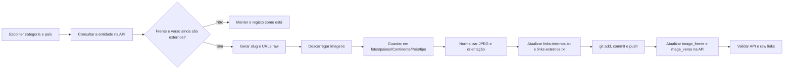

# All_Coins

## Menu principal

Para o fluxo normal, usa:

```bash
python3 main.py
```

O menu permite verificar a API, preparar imagens, executar a migração completa
ou alterar apenas os URLs da Base44, escolhendo um país ou todos os pendentes.
Os comandos técnicos estão em [docs/COMMANDS.md](docs/COMMANDS.md).

Este repositório guarda imagens do catálogo por continente e país e atualiza
as entidades `Coin`, `SpecialCoin` e `CountryNote` para usarem URLs raw do
GitHub.

Os nomes canónicos dos tipos são `normal`, `collection`, `notes` e `souvenir`.
Atualmente `normal`, `collection` e `notes` são tratados pelo `main.py`;
`souvenir` será adicionado numa fase posterior.

```text
fotos/paises/<Continente>/<Pais>/<tipo>/
  links-internos.txt
  links-externos.txt
  frente/
  tras/
```

## Fluxo


```mermaid
flowchart LR
  A[Escolher categoria e país] --> B[Consultar a entidade na API]
  B --> C{Frente e verso ainda são externos?}
  C -- Não --> D[Manter o registo como está]
  C -- Sim --> E[Gerar slug e URLs raw]
  E --> F[Descarregar imagens]
  F --> G[Guardar em fotos/paises/Continente/Pais/tipo]
  G --> H[Normalizar JPEG e orientação]
  H --> I[Atualizar links-internos.txt e links-externos.txt]
  I --> J[git add, commit e push]
  J --> K[Atualizar image_frente e image_verso na API]
  K --> L[Validar API e raw links]
```

## Preparação

1. Coloca a API key no ficheiro local `.env`:

```env
ALL_COINS_API_KEY=...
```

2. Confirma que `.env` continua ignorado pelo Git:

```bash
git check-ignore -v .env
```

3. Se precisares de instalar dependências de download:

```bash
python3 -m pip install --break-system-packages playwright
python3 -m playwright install chromium
```

Também funciona com `chromium`, `chromium-browser`, `google-chrome` ou `google-chrome-stable` já instalados no sistema.

As imagens do Numista podem exigir uma sessão Chrome real por causa do
Cloudflare. Abre o Chrome com `--remote-debugging-port=9222`, resolve o desafio
e deixa a janela aberta. O sincronizador de `notes` liga-se a essa sessão sem
a fechar.

## Verificar Pendências

Antes de processar países novos, vê se ainda há alguma moeda na API com links uCoin:

```bash
python3 scripts/check_ucoin_links_api.py
```

Resultado esperado quando está tudo migrado:

```text
countries_with_ucoin=0
coins_with_ucoin=0
OK: nenhuma moeda ainda aponta para i.ucoin.net.
```

Para verificar só um país:

```bash
python3 scripts/check_ucoin_links_api.py --country "EUA"
```

## Processar Um País

O fluxo normal para um país é:

```bash
python3 scripts/sync_coin_images_api.py --country "Polónia" --download-current --apply --git-commit-message "Add Poland coin images"
```

Isto faz, por ordem:

1. Consulta as moedas do país na API.
2. Salta moedas que não tenham `i.ucoin.net` nos dois lados.
3. Descarrega `image_frente` e `image_verso` atuais.
4. Guarda imagens em `fotos/paises/<Continente>/<Pais>/normal/frente` e `tras`.
5. Atualiza `links-internos.txt` com URLs raw do GitHub.
6. Atualiza `links-externos.txt` com os URLs originais do uCoin.
7. Faz `git add .`, `git commit` e `git push`.

   Em WSL, se `git.exe` estiver disponível, o script usa-o automaticamente
   para estas operações. Assim reutiliza a sessão do Git Credential Manager do
   Windows; nos restantes ambientes usa o `git` normal.
8. Atualiza `image_frente` e `image_verso` na API.
9. Volta a consultar a API para verificar a atualização.

Os URLs raw ficam neste formato:

```text
https://raw.githubusercontent.com/Domandrenog/All_Coins/main/fotos/paises/<Continente>/<Pais>/normal/frente/<slug>.jpg
https://raw.githubusercontent.com/Domandrenog/All_Coins/main/fotos/paises/<Continente>/<Pais>/normal/tras/<slug>.jpg
```

## Testar Sem Alterar

Para ver o plano sem descarregar, sem commit e sem atualizar a API:

```bash
python3 scripts/sync_coin_images_api.py --country "Polónia" --no-git-push
```

Para descarregar e criar links locais, mas sem atualizar a API nem fazer commit/push:

```bash
python3 scripts/sync_coin_images_api.py --country "Polónia" --download-only --no-git-push
```

Este modo é útil para países grandes. Depois de validar os ficheiros locais, faz commit/push e só então atualiza a API.

## Processar Uma Moeda

Quando filtras por `--name`, usa sempre `--years` para não apanhar a moeda errada:

```bash
python3 scripts/sync_coin_images_api.py --country "Polónia" --name "1 grosz" --years 2018 --download-current --apply
```

Se precisares de forçar um slug específico:

```bash
python3 scripts/sync_coin_images_api.py --country "Polónia" --name "1 grosz" --years 2018 --slug poland-1-grosz-2018 --download-current --apply
```

Se já sabes o ID da moeda:

```bash
python3 scripts/sync_coin_images_api.py --coin-id "<Coin_id>" --country-folder Polonia --slug poland-1-grosz-2018 --download-current --apply
```

## Regras Importantes

Moedas sem `i.ucoin.net` nos dois lados ficam como estão por defeito. Isto evita substituir imagens da Base44 ou outros hosts por links raw incompletos.

Para forçar inclusão dessas moedas:

```bash
python3 scripts/sync_coin_images_api.py --country "Tailândia" --download-current --apply --include-without-ucoin
```

Se duas moedas gerarem o mesmo nome de ficheiro a partir do URL original, o script acrescenta dados da moeda ao slug para manter ficheiros e links separados.

Por defeito, os continentes e países são normalizados para pastas sem acentos.
Os continentes ficam como `Africa`, `America`, `Asia`, `Europa` e `Oceania`; os
nomes compostos dos países ficam com as palavras juntas. Exemplos:

- `Índia` vira `India`
- `África do Sul` vira `AfricaDoSul`

Alguns países têm mapeamentos explícitos quando o nome da API não deve ser usado diretamente ou quando há tradução:

- `Bielorrussia`
- `CoreiaDoSul`
- `EmiradosArabesUnidos`
- `Japao`
- `Malasia`
- `Romenia`
- `Russia`
- `Tailandia`
- `Tunisia`
- `EUA`

## Validar Depois

Depois de processar um país, confirma primeiro a API:

```bash
python3 scripts/check_ucoin_links_api.py --country "Polónia"
```

Para uma verificação rápida dos ficheiros locais de um país:

```bash
python3 - <<'PY'
from pathlib import Path

folder = Path('fotos/paises/Europa/Polonia/normal')
links_path = folder / 'links-internos.txt'
entries = []
current = None

for line in links_path.read_text(encoding='utf-8').splitlines():
    if line and not line.startswith(' '):
        current = line.rstrip(':')
    elif current and line.strip().startswith(('frente:', 'tras:')):
        side, url = line.strip().split(': ', 1)
        entries.append((current, side, url))

print('moedas=', len({slug for slug, _, _ in entries}))
print('links=', len(entries))
print('frente=', len(list((folder / 'frente').glob('*.jpg'))))
print('tras=', len(list((folder / 'tras').glob('*.jpg'))))
PY
```

## Ficheiros Gerados

Cada país processado fica com:

```text
fotos/paises/<Continente>/<Pais>/normal/
  links-internos.txt
  links-externos.txt
  frente/
    <slug>.jpg
  tras/
    <slug>.jpg
```

`links-internos.txt` guarda os URLs raw do próprio repositório usados pela API.

`links-externos.txt` guarda os URLs externos originais para referência
histórica.

Nas notas, o script aplica primeiro a orientação EXIF e recorta margens brancas
excessivas. Quando a digitalização continua vertical, roda-a 90 graus para que
a nota fique horizontal antes de criar o JPEG final. A opção técnica
`--keep-portrait` desativa essa rotação.

## Troubleshooting

Se um download uCoin falhar, testa o URL isoladamente:

```bash
python3 scripts/probe_ucoin_download.py "https://i.ucoin.net/coin/.../imagem.jpg"
```

Para testar com Chromium/Playwright:

```bash
python3 scripts/probe_ucoin_download.py "https://i.ucoin.net/coin/.../imagem.jpg" --playwright
```

Um download só conta como sucesso quando:

- HTTP é `2xx`;
- `Content-Type` contém `image`;
- o ficheiro tem conteúdo.

Se o resultado for `403` ou HTML com `Just a moment...`, é bloqueio Cloudflare.

Se o resultado for `404` no Chromium autenticado, o link do uCoin provavelmente está quebrado; deixa essa moeda como está até haver imagem válida.

## Ferramentas Antigas

`scripts/download_images.py` ainda existe para recolher imagens a partir de uma página ou ficheiro de input, mas o fluxo principal hoje é `scripts/sync_coin_images_api.py`.

Exemplo com URL:

```bash
python3 scripts/download_images.py --url "https://track-coin-collection.base44.app/country?continent=Europa&country=Bielorr%C3%BAssia" --output fotos/paises/Europa/Bielorrussia/normal
```

Exemplo com login manual no Chromium:

```bash
python3 scripts/download_images.py --url "https://track-coin-collection.base44.app/country?continent=Europa&country=Bielorr%C3%BAssia" --output fotos/paises/Europa/Bielorrussia/normal --headful --manual-login
```

Exemplo com ficheiro de links:

```bash
python3 scripts/download_images.py --input fotos/paises/Europa/Bielorrussia/normal/links-externos.txt --output fotos/paises/Europa/Bielorrussia/normal
```
